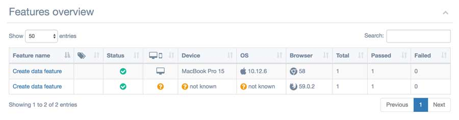
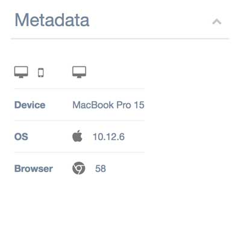

# wdio-multiple-cucumber-html-reporter
A WebdriverIO plugin. Reporter that creates beautiful Cucumber HTML reports (https://github.com/wswebcreation/multiple-cucumber-html-reporter)

## Metadata
The report can also show on which browser / device a feature has been executed. It is shown on the features overview in the table, like this
 
as well as on the feature overview in the container, like this
 

You can add this by adding the following object to your `capabilities`;

```js
exports.config = {
    //..
    capabilities: [
        {
            browserName: 'chrome',
            // Add this
            metadata: {
                browser: {
                    name: 'chrome',
                    version: '58'
                },
                device: 'MacBook Pro 15',
                platform: {
                    name: 'OSX',
                    version: '10.12.6'
                }
            },
        },
    ],
};
```

See the metadata information [here](https://github.com/wswebcreation/multiple-cucumber-html-reporter#metadatabrowsername) for the correct values.

> If you don't provide the `browser`-object in the metadata, this module will automatically determine it for you

> If you don't provide the `device` and or the `platform`-object it will be defaulted for you to `not known` 

> If you don't provide a `browser.name` or a `browser.version` the module will try to determine this automatically. The rest will be shown as questionmarks in the report


## TODO:
### high priority
Needs to be in the first beta
- [x] Add `Before`-step to the json, see the remarks about the Before steps
- [x] Add `After`-step to the json, see the remarks about the After steps
- [x] Add browser data to the report, first start with the default capabilities
- [x] Add screenshots to the report
- [x] Add multiple screenshots to the report in 1 step
- [x] Test in multiple browsers in parallel
- [ ] Check / add `Passed` status
- [ ] Check / add `Failed` status
- [ ] Check / add `Pending` status
- [ ] Check / add `Ambiguous` status
- [ ] Check / add `Skipped` status
- [ ] Check / add `undefined` status
- [ ] Test on Windows
- [ ] Test on Android
- [ ] Test on iOS
- [ ] Look at [CucumberJS feature](https://github.com/cucumber/cucumber-js/tree/master/features)-files to see what I've missed 

### low priority
Needs to be in, but are not mandatory
- [ ] Add `Hooks` to the json
- [ ] Add attachments to the report, see [attachments](https://github.com/cucumber/cucumber-js/blob/master/docs/support_files/attachments.md)


### research
- [ ] Find out where the keywords are, there is no `Given, When, Then` comming back from webdriver.io 
- [ ] Add data tables to the report, see [data tables](https://github.com/cucumber/cucumber-js/blob/master/features/data_tables.feature) => **CURRENTLY NOT SUPPORTED BY WDIO-CUCUMBER-FRAMEWORK, NEED TO INVESTIGATE THIS**


## Some remarks
### Before hooks
Investigate how this works in Allure
#### Pass
Not logged in wdio-cucumberjs-framework => not in this module

#### Failed
Automatically logged by my implementation, not all data is logged like screenshots and so on

#### Pending
Pending state will result in the following:
- Beforehook will not get the status, there is only a start, not a pass/failed/pending
- All Scenario steps will get status pending
Meaning I can't log this

### After hooks
Investigate how this works in Allure
#### Pass
Not logged in wdio-cucumberjs-framework => not in this module
#### Failed
Automatically logged by my implementation, not all data is logged like screenshots and so on

#### Pending
Status pending of the After hook has no effect on the status of the report / wdio-cucumber-framework will not report this status

## FAQ's

### I don't see the keywords `Given, When, Then` in the report
The module `wdio-cucumber-framework` doesn't provide this information so it can't be shown in the report.
